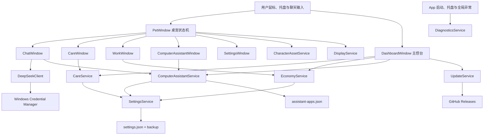

# DeepSeek 鲸鱼娘桌宠“小鲸”完整项目介绍

## 1. 文档用途

本文是 DeepSeek 鲸鱼娘桌宠项目的完整介绍文件，面向以下读者：

- 第一次了解项目、不会编程但想知道桌宠能做什么的用户；
- 需要继续提出功能需求、调整玩法和确认产品方向的项目维护者；
- 未来接手 WPF、数值系统、电脑助手、更新器或 OpenClaw 连接器的开发者；
- 在 GitHub、Release 或其他渠道公开发布前负责安全、隐私、许可证和素材授权审查的发布者；
- 希望检查项目是否真正实现了 README 所述功能的测试人员。

本文尽量完整记录当前已经实现的能力、精确数值、状态流转、文件结构、数据位置、安全边界、验证情况、已知限制和正式发布前必须完成的事项。仓库首页的 [README.md](README.md) 用于快速浏览；本文用于深入理解，不应只阅读其中一份。

## 2. 当前项目状态

| 项目 | 当前情况 |
| --- | --- |
| 项目名称 | DeepSeek 鲸鱼娘桌宠 |
| 角色名称 | 小鲸 |
| 内部角色 ID | `deepseek-xiaojing` |
| 程序版本 | `1.0.0` |
| 目标平台 | Windows 11 x64 |
| UI 技术 | WPF |
| 运行框架 | .NET 8 |
| 程序类型 | Windows 桌面应用、系统托盘程序、透明桌宠 |
| 开发状态 | v1.0 正式构建；后续功能继续迭代 |
| 正式发布 | 已生成 Windows 11 x64 自包含 ZIP |
| 正式安装程序 | 尚未制作 |
| 代码签名 | 尚未配置 |
| 项目自身许可证 | 尚未选择，当前默认保留全部权利 |
| 素材公开分发授权 | 尚待发布者最终确认 |
| OpenClaw | 只有设计方案，当前未集成、未捆绑、未自动安装 |

当前源码可以编译和运行，主要功能已经形成闭环。项目维护者已明确发出 v1.0 打包指令，因此可以生成正式自包含 ZIP。公开上传、商业分发或大范围传播前，实际发布者仍需独立确认角色素材、名称标识、目标地区法律、代码签名和漏洞响应安排；本地生成正式包不代表这些外部权利已经自动取得。

## 3. 一句话介绍

小鲸是一只会在 Windows 11 桌面上自然活动的 DeepSeek 鲸鱼女仆桌宠，同时也是一个具备聊天、生活照顾、经济与疲惫玩法、外出打工、集中主控、安全应用启动和未来智能代理扩展能力的本地电脑伙伴。

## 4. 产品定位

### 4.1 不只是桌面摆件

传统桌宠通常只负责播放动画和响应点击。本项目希望小鲸具有持续状态和可成长的陪伴感：

- 她会待机、呼吸、眨眼、挥手、思考、困倦、惊讶和散步；
- 她有饱食、口渴、清洁、疲惫和鲸币状态；
- 她可以吃东西、喝水、洗澡、休息、睡觉和外出工作；
- 她能通过 DeepSeek API 聊天，并把回复显示为桌面气泡；
- 她可以在用户明确授权后打开允许列表中的应用；
- 她有一个主控台，让用户不用理解代码也能查看完整状态和控制功能。

### 4.2 不把 AI 权限无限放大

项目同时强调安全。电脑助手第一阶段只负责打开白名单 EXE，不让模型直接执行任意命令、参数、脚本或文件操作。OpenClaw 等完整智能代理框架只保留为未来可选连接器，不作为普通用户默认依赖。

### 4.3 文件夹式而不是单文件黑盒

项目明确要求 EXE 只是启动方式。发布时保留：

- 小型 AppHost 启动 EXE；
- 独立程序 DLL；
- .NET 自包含运行时文件；
- 外部角色图集和角色描述；
- 外部默认设置和默认应用允许列表；
- README、免责声明、安全、隐私和第三方说明。

这种结构比把所有内容压入单个 EXE 更容易替换素材、检查配置、审计第三方内容、做完整文件夹更新和排查问题。

## 5. 目标用户与使用场景

### 5.1 目标用户

- 喜欢二次元桌宠、DeepSeek 同人形象或鲸鱼女仆角色的 Windows 用户；
- 希望桌面上有陪伴感、状态互动和轻量养成玩法的用户；
- 希望在桌宠聊天中安全打开常用程序，但不愿授予任意 Shell 权限的用户；
- 不会编程、希望通过图形界面完成配置和更新的普通用户；
- 希望研究 WPF 透明桌宠、离线状态结算和本地 AI 助手安全设计的开发者。

### 5.2 典型场景

- 工作时让小鲸在屏幕边缘待机或自动散步；
- 双击小鲸询问 DeepSeek 问题；
- 对小鲸说“帮我打开记事本”，核对路径后打开程序；
- 临时不需要桌宠时将她滑入屏幕侧边，而不是完全退出；
- 从主控台查看小鲸是否饿、渴、脏、疲惫或正在工作；
- 给小鲸喂食、饮水、清洁，或安排短时工作赚取鲸币；
- 调整角色大小、置顶、鼠标穿透和自动散步；
- 在维护者配置真实 GitHub 仓库与 Release 后，由主控台检查新版本并进行完整目录更新。

## 6. 设计原则

### 6.1 用户能够理解

核心功能必须有可见入口、状态说明和失败提示。用户不需要编辑代码即可聊天、照顾、工作、调整大小、隐藏、恢复、管理应用或检查更新。

### 6.2 默认安全

高风险能力默认关闭。应用启动需要首次同意、允许列表、逐次确认和本地审计。未知路径、脚本、网络路径、命令解释器和参数默认拒绝。

### 6.3 不出现资源死循环

养成系统必须保证任何状态都有免费恢复路径，不能出现“没钱所以不能吃饭、太饿所以不能工作、因此永远没钱”的锁死情况。

### 6.4 离线状态可恢复

生活衰减、疲惫恢复和工作完成使用时间戳保存。关闭程序不是暂停世界，但所有数值都会限制范围并限制最长离线计算跨度，避免系统时钟异常造成失控。

### 6.5 不干扰桌面工作

桌宠支持贴边隐藏、完全隐藏、鼠标穿透、多显示器工作区、悬停暂停散步和托盘恢复。隐藏状态降低刷新频率，不继续进行高频可视动画。

### 6.6 发布前风险透明

免责声明不能代替授权或法律。项目将安全边界、数据位置、第三方关系、素材风险和未完成事项写入独立文档，并随运行文件夹发布。

### 6.7 统一二次元视觉体系

界面采用“小鲸 · 深海星梦”主题，以角色图集中的深海蓝女仆装、冰蓝发梢和薰衣草紫阴影为配色依据。全局 `App.xaml` 提供窗口背景、蓝紫渐变页头、半透明卡片、圆角按钮、输入框、进度条、复选框、列表和右键菜单样式；主控台再加入角色立绘、星光、气泡和角色化文案。

视觉层级遵循：深色渐变页头负责身份识别，白色卡片承载功能，蓝紫渐变表示主要操作，浅蓝按钮表示次要操作，黄色和红色区域继续保留警告意义。鲸币使用 Windows 不同字重稳定支持的 `◆`，避免部分彩色 Emoji 在 WPF 中显示为方框。主题覆盖主控台、聊天、照顾、打工、设置、电脑助手和安全须知，但不改变原有按钮事件、数值规则或安全确认流程。

角色右键菜单使用 WPF 圆角模板，提供悬停高亮、勾选状态、二级大小菜单和统一符号；任务栏通知区域中的托盘右键菜单由 `AnimeTrayMenuRenderer` 绘制深海蓝紫背景、圆角选中块和细分隔线。Windows 资源管理器对 `DeepSeek桌宠.exe` 文件显示的系统右键菜单不属于应用窗口：项目不安装外壳扩展、不注入资源管理器，也不修改该系统菜单，以避免管理员权限、资源管理器崩溃、杀毒误报和卸载残留等风险。

## 7. 用户首次启动体验

### 7.1 单实例检查

程序启动时创建名称为 `Local\DeepSeekDesktopPet.Win11` 的互斥体，避免同一份设置被多个桌宠同时写入。首次实例同时监听 `Local\DeepSeekDesktopPet.ShowDashboard` 自动重置事件：

- 手动启动且没有现有实例时，显示桌宠并自动打开主控台；
- 开机启动使用 `--autostart`，显示桌宠和托盘但不弹主控台；
- 桌宠已在运行时再次手动双击 EXE，新进程不创建第二只桌宠，而是通知现有实例打开并激活主控台；
- Windows 重复触发 `--autostart` 时，新进程静默退出，不打扰用户。

只有真正持有互斥体的首个实例才释放互斥体，避免第二实例退出时错误释放不属于它的同步对象。

### 7.2 加载外部角色素材

`CharacterAssetService` 从程序目录读取：

- `Assets/Characters/XiaoJing/pet.json`
- `Assets/Characters/XiaoJing/spritesheet.png`
- `Assets/Characters/XiaoJing/walk-cycle-v2.png`

角色描述文件定义角色 ID、显示名、基础图集、网格行列、动作帧编号和独立动画图集。基础图集负责待机与互动姿势，连续步态图集负责真正的双腿交替动画。图集缺失或描述错误属于程序无法正常展示角色的关键错误，因此发布文件夹不能遗漏素材目录。

### 7.3 加载和恢复设置

`SettingsService` 优先读取用户数据目录中的 `settings.json`。读取失败时尝试 `settings.backup.json`；如果备份也不可用，则加载程序目录中的 `Config/default-settings.json`。发生恢复或重置时，托盘会显示通知，并把详情写入诊断日志。

### 7.4 恢复屏幕位置

程序根据保存坐标判断角色应该出现在哪个显示器工作区。无有效保存坐标时，小鲸默认出现在当前工作区右下附近。无效、过远或不适用于当前屏幕布局的坐标会被限制或回退，避免更换显示器后角色彻底丢失。

### 7.5 播放启动登场

普通启动时：

1. 窗口初始透明，避免 WPF 句柄创建时闪现在默认位置；
2. 小鲸从目标位置下方上浮；
3. 窗口逐渐显现；
4. 角色从约 72% 视觉比例回弹到正常大小；
5. 伴随轻微旋转、落地超调和蓝色光晕；
6. 表情从惊讶切换为挥手；
7. 显示“我来啦～”；
8. 约 1.5 秒后进入普通状态机。

用户在登场过程中点击角色会立即完成动画，不会被锁住。若存档为贴边隐藏，登场动画跳过并直接显示侧边把手。若有离线未完成工作，登场后显示“工作还在继续，我回来啦～”，随后恢复工作状态。

## 8. 桌宠窗口和交互

### 8.1 窗口属性

桌宠主窗口使用：

- 无边框；
- 透明背景；
- 不显示任务栏按钮；
- 默认始终置顶；
- 默认逻辑尺寸 `320 × 430`，再乘用户缩放比例；
- 角色图像保持等比缩放和高质量位图缩放；
- 顶部气泡和侧边恢复把手叠加在同一透明窗口内。

### 8.2 鼠标操作

| 输入 | 处理 |
| --- | --- |
| 单击 | 随机选择挥手、思考、惊讶或困倦帧，显示随机气泡 |
| 双击 | 打开聊天窗口 |
| 按住并移动 | 进入拖拽状态，角色惊讶、上浮并根据移动方向倾斜 |
| 松开拖拽 | 保存新位置 |
| 在左/右屏幕边缘松开 | 进入对应侧边的贴边隐藏状态 |
| 鼠标悬停 | 暂停自动散步，约 220 毫秒后在角色身边显示快捷互动气泡 |
| 右键 | 显示完整桌宠菜单 |

拖拽开始使用 4 像素阈值，避免普通点击被误判为拖动。程序把按下点和移动点换算为稳定的桌面坐标，不使用会随窗口移动而变化的窗口内相对位移；目标位置还会吸附到当前 DPI 对应的物理像素，并跳过没有实际变化的坐标提交。这样可避免透明 WPF 窗口在鼠标和窗口相互影响时前后往返、高频闪动。移动坐标会限制在目标显示器工作区内。

悬停互动气泡使用独立透明 `Popup` 放置在角色右侧；如果靠近屏幕边缘，WPF 会将弹层调整到可见区域。气泡提供“饭团、清水、擦拭、摸摸”四个入口：前三项复用 `CareService` 的原始价格、数值和存档逻辑，饭团消耗 8 鲸币，清水与擦拭免费；摸摸只触发角色反馈。鼠标可从角色移动到气泡继续操作，离开两者约 320 毫秒后淡出。拖拽、贴边隐藏、完全隐藏和鼠标穿透状态会立即关闭气泡。

### 8.3 右键菜单

当前包含：

- 打开小鲸主控台；
- 和小鲸聊天；
- 电脑助手 · 打开应用；
- 照顾小鲸；
- 外出打工与休息；
- 随机互动；
- 隐藏到屏幕侧边或从侧边恢复；
- 桌宠大小 50%、75%、100%、125%、150%、200% 和更多设置；
- 自动散步；
- 始终置顶；
- 鼠标穿透；
- 设置；
- 退出。

照顾菜单标题实时显示饱食、口渴和清洁；工作菜单标题实时显示鲸币和疲惫。

### 8.4 系统托盘

托盘菜单提供：

- 打开主控台；
- 显示桌宠；
- 聊天；
- 电脑助手；
- 照顾；
- 打工与休息；
- 随机互动；
- 侧边隐藏或恢复；
- 切换鼠标穿透；
- 设置；
- 退出。

双击托盘图标打开聊天。托盘是完全隐藏和鼠标穿透状态下的主要恢复通道。

## 9. 动画系统

### 9.1 外部动作图集

基础图集 `spritesheet.png` 为 `4 × 2`，共 8 帧：

| 索引 | 键名 | 用途 |
| ---: | --- | --- |
| 0 | `idle` | 普通待机 |
| 1 | `blink` | 眨眼 |
| 2 | `wave` | 挥手和开心互动 |
| 3 | `thinking` | 思考和工作 |
| 4 | `surprised` | 点击、拖拽和意外反应 |
| 5 | `sleepy` | 困倦、休息和状态不佳 |
| 6 | `walkA` | 旧版左向行走回退姿势 |
| 7 | `walkB` | 旧版右向行走回退姿势 |

连续图集 `walk-cycle-v2.png` 同样为 `4 × 2`，按阅读顺序提供 8 帧左向行走周期。帧中双腿依次经过接触、下压、经过和抬起阶段，手臂、裙摆、头发与鲸尾随步伐轻微跟随。向右行走复用同一周期并只做水平镜像，从而保持角色尺度、基线和绘制细节一致。

两套图集均使用透明背景，运行时切割为独立 `CroppedBitmap` 并冻结，减少重复解码和线程访问问题。若新版步态配置缺失，程序仍可回退到基础图集的左右行走姿势，便于排查不完整角色包。

### 9.2 状态优先级

桌宠状态包括：

1. `Hidden`：窗口不可见；
2. `EdgeTransition`：正在滑入或滑出侧边；
3. `EdgeHidden`：贴边隐藏；
4. `Starting`：启动登场；
5. `Dragging`：用户拖拽；
6. `Reacting`：点击、聊天或系统通知反应；
7. `Working`：进行外出工作；
8. `Walking`：自动散步；
9. `Autonomous`：随机挥手、思考或打盹；
10. `Blinking`：短暂眨眼；
11. `Idle`：普通待机。

高优先级状态会阻止低优先级状态覆盖动画。例如拖拽期间不会自动散步，工作期间不会随机眨眼抢走思考帧，贴边隐藏期间不会弹出生活提醒。

### 9.3 连续帧、过渡与程序化自然动作

- 待机：幅度较低的正弦呼吸、轻微摇摆和上下浮动，间隔触发眨眼、挥手、思考或困倦动作；
- 行走：以约 `9 FPS` 播放 8 帧真实步态循环，双腿和双脚会交替迈动；向右时镜像整套步态，只有确定行走方向时才改变朝向；程序化倾斜与起伏降低到很小幅度，避免与帧内动作叠加后显得跳跃；
- 动作切换：桌宠窗口使用当前层和上一层两张图像，状态改变时进行约 `140 ms` 交叉淡化，并叠加约 `190 ms` 的轻微压缩、抬起和回稳包络；步态内部帧不做长淡化，保持脚步清晰且没有重影；
- 互动：使用正弦弧线完成上跳和回落，惊讶时增加轻微抖动；
- 自由动作：挥手时增加角度变化，困倦时减少上浮；
- 工作：缓慢专注呼吸和轻微摇摆；
- 拖拽：轻微放大、上浮并按鼠标水平位移小幅倾斜；视觉由有效鼠标位移更新，计时器在拖拽状态不重复改写透明窗口；
- 启动：下方上浮、渐显、回弹、旋转、光晕和挥手。

### 9.4 定时器节能

桌宠可见且未贴边时使用约 50 毫秒间隔驱动动画。完全隐藏或贴边时切换为约 500 毫秒间隔，降低不必要的 CPU 唤醒。生活状态和经济状态另有较低频率检查，不会每帧写入磁盘。

## 10. 自动散步与多显示器

随机散步默认关闭，使小鲸以安静待机为主要状态。开启后，不再按固定周期移动：18% 的候选等待落在 45–90 秒，54% 落在 90–210 秒，28% 落在 210–360 秒；到达候选时刻后仍有 30% 概率放弃本次散步并继续待机。实际散步持续约 1.8–5 秒，速度在每秒 `60–92 × 缩放比例` 逻辑像素间随机，左右方向也独立随机。刚启用功能、鼠标悬停打断或用户拖放角色后，至少保留 60 秒安静期。到达当前显示器工作区边缘时结束本次散步并进入安静期，不会立即反向造成突兀掉头。

`DisplayService` 使用 Windows Forms `Screen` 获得显示器工作区，并通过 WPF 的设备/逻辑像素变换处理 DPI。以下行为都使用角色当前所在显示器：

- 初始位置恢复；
- 拖拽限制；
- 自动散步边界；
- 缩放后重新定位；
- 贴边隐藏方向和坐标；
- 主控台显示当前显示器名称。

这使不同分辨率、缩放比例和多屏排列下的行为比只使用主屏坐标更可靠。

## 11. 大小、置顶、鼠标穿透和隐藏

### 11.1 大小

用户缩放范围为 `0.4–2.0`，即 40%–200%。设置页使用 5% 步进，主控台可实时调整，右键菜单提供常用预设。

缩放时程序保留角色旧中心和底部位置，并限制到当前工作区。贴边状态缩放时重新计算把手和隐藏坐标。

### 11.2 始终置顶

默认开启。用户可从右键、主控台或设置页关闭，状态保存到 `settings.json`。

### 11.3 鼠标穿透

鼠标穿透通过 Windows 扩展窗口样式 `WS_EX_TRANSPARENT` 实现。开启后角色不接收普通鼠标输入，必须从托盘菜单关闭。

贴边隐藏时，程序会确保恢复把手仍可点击，不让鼠标穿透造成永久无法恢复。

### 11.4 贴边隐藏

用户可以从右键菜单、主控台操作，也可以直接把角色拖到当前显示器左/右边缘后松开。拖拽进入约 `28 × 缩放比例` 逻辑像素的吸附区域时，角色边缘会出现蓝紫色“松开隐藏”提示。随后程序：

1. 保存隐藏前正常位置；
2. 比较角色中心和当前工作区中心，选择最近的左或右侧；
3. 显示侧边把手；
4. 把窗口滑到屏幕外，仅保留约 34 像素宽区域；
5. 更新右键菜单文字并保存 `EdgeHidden` 与 `EdgeSide`。

点击把手或使用托盘命令后，窗口滑回隐藏前位置并恢复普通角色图像。

### 11.5 完全隐藏

完全隐藏调用窗口 `Hide()`，但应用和托盘继续运行。主控台仍可重新显示桌宠。完全退出必须使用右键或托盘的“退出”。

## 12. 聊天系统

### 12.1 配置

用户可以设置：

- 桌宠名称；
- API 地址；
- 模型名称；
- DeepSeek API Key；
- 角色系统提示词；
- 自动散步、始终置顶、鼠标穿透和缩放。

默认 API 地址为 `https://api.deepseek.com`，默认模型字段为 `deepseek-v4-flash`，默认关闭思考模式并使用温度 `0.7`。

### 12.2 API Key

API Key 使用 Windows Credential Manager 的通用凭据保存，目标名为 `DeepSeekDesktopPet.ApiKey`。设置窗口留空不会覆盖已有 Key，并提供清除按钮。

Key 不写入：

- `Config/default-settings.json`；
- `%APPDATA%` 普通设置；
- 聊天 UI 日志；
- 崩溃日志的正常路径；
- GitHub 更新配置。

### 12.3 请求流程

普通聊天消息会与当前窗口周期的历史一起发送到 `{ApiBaseUrl}/chat/completions`。请求包含系统提示词、角色消息、模型、非流式设置、关闭思考模式和温度。HTTP 超时为 120 秒。

成功回复显示在聊天窗口，并截短后作为桌宠气泡。失败时只显示安全解析后的 API 错误信息或 HTTP 状态。

### 12.4 当前聊天限制

- 不支持流式逐字输出；
- 关闭聊天窗口后当前历史不持久化；
- 没有联网搜索工具或任意电脑操作工具；
- 模型名称是否可用取决于用户 API 提供方的实际支持；
- AI 回复可能错误，不应用作高风险专业决策的唯一依据。

### 12.5 本地助手命令分流

聊天输入若以“打开”“启动”“运行”等受支持前缀开始，会先由本地电脑助手解析。匹配规则要求目标名称与允许应用名称、EXE 文件名或配置别名精确一致。

本地命令：

- 不加入发送给模型的聊天历史；
- 未启用电脑助手时只显示启用说明；
- 未匹配允许列表时拒绝执行；
- 匹配后显示完整路径确认；
- 用户拒绝确认时不启动任何进程。

## 13. 生活照顾系统

### 13.1 状态定义

| 状态 | 范围 | 好坏方向 | 默认值 | 每小时变化 |
| --- | --- | --- | ---: | ---: |
| 饱食度 `Satiety` | 0–100 | 高为好 | 80 | -2.2 |
| 口渴度 `Thirst` | 0–100 | 低为好 | 20 | +3.6 |
| 清洁度 `Cleanliness` | 0–100 | 高为好 | 90 | -1.25 |

所有结果都限制在 0–100。生活时间戳保存在 `CareUpdatedUtc`。

### 13.2 离线衰减

每次打开照顾窗口、定时检查或执行照顾动作时，程序根据当前 UTC 与上次更新时间计算差值。负时间差按 0 处理，超过 30 天按 30 天处理，降低系统时间异常或长期离线造成的极端跳变。

### 13.3 照顾项目完整数值

| 动作 ID | 显示项目 | 价格 | 饱食 | 口渴 | 清洁 | 说明 |
| --- | --- | ---: | ---: | ---: | ---: | --- |
| `rice_ball` | 饭团 | 8 | +28 | 0 | -1 | 高性价比主食 |
| `cake` | 小蛋糕 | 14 | +18 | +3 | -3 | 甜食会更渴、更容易弄脏 |
| `dried_fish` | 小鱼干 | 10 | +14 | +2 | -1 | 轻量食物 |
| `relief_meal` | 应急便当 | 0 | +30 | 0 | 0 | 仅经济救济开放时可用 |
| `water` | 清水 | 0 | 0 | -40 | 0 | 永久免费的基本恢复 |
| `milk` | 牛奶 | 7 | +8 | -30 | -1 | 同时提供少量饱食 |
| `berry_soda` | 蓝莓汽水 | 9 | +3 | -22 | -1 | 轻量饮料 |
| `wipe` | 擦一擦 | 0 | 0 | 0 | +30 | 永久免费的基本清洁 |
| `bath` | 洗澡 | 6 | 0 | -5 | +100 后钳制到 100 | 完整清洁 |

购买前先检查鲸币；余额不足不会扣钱或改变状态。成功后更新时间并立即保存。

### 13.4 状态提醒

危险条件：

- 口渴度 `>= 80`；
- 饱食度 `<= 20`；
- 清洁度 `<= 20`。

一般条件：

- 口渴度 `>= 55`；
- 饱食度 `<= 45`；
- 清洁度 `<= 45`。

程序约每分钟刷新生活状态，危险提醒之间至少间隔约 10 分钟。贴边隐藏或完全隐藏时不会主动弹出角色提醒。

## 14. 经济、鲸币与疲惫系统

### 14.1 基础状态

| 状态 | 默认值 | 范围或规则 |
| --- | ---: | --- |
| 鲸币 `Coins` | 30 | 不允许结算为负数 |
| 疲惫 `Fatigue` | 15 | 0–100，越低越好 |
| 工作阻止阈值 | 80 | 疲惫达到或超过 80 不能接新工作 |
| 自然恢复 | 每小时 -5 | 空闲时按现实时间恢复 |

经济更新时间保存在 `EconomyUpdatedUtc`。

### 14.2 工作完整数值

| ID | 名称 | 描述 | 时长 | 报酬 | 疲惫 | 饱食 | 口渴 | 清洁 |
| --- | --- | --- | ---: | ---: | ---: | ---: | ---: | ---: |
| `data_sort` | 整理数据 | 帮忙整理一批数据表，轻松稳定 | 20 秒 | +12 | +10 | -4 | +4 | -1 |
| `model_test` | 模型测试 | 测试回复质量，需要集中一会儿 | 45 秒 | +28 | +18 | -7 | +7 | -2 |
| `night_compute` | 算力值班 | 照看一轮计算任务，收入高但更累 | 90 秒 | +60 | +32 | -12 | +12 | -4 |

### 14.3 开始工作条件

工作开始前依次检查：

1. 工作 ID 必须存在；
2. 当前不能已经有另一份工作；
3. 疲惫必须低于 80；
4. 饱食度必须高于 20；
5. 口渴度必须低于 80。

清洁度不会阻止工作，避免清洁状态造成额外锁死，但工作会消耗少量清洁度。

### 14.4 工作存档与离线结算

开始工作时保存：

- `ActiveJobId`；
- `ActiveJobStartedUtc`；
- `ActiveJobEndsUtc`；
- `EconomyUpdatedUtc`。

程序关闭不取消工作。下次启动或刷新时，如果结束时间已经到达，程序一次性发放报酬并结算疲惫、饱食、口渴和清洁变化，然后清空活动工作字段。

### 14.5 取消、休息和睡觉

- 取消工作：立即清除工作，不发报酬，也不施加工作成本；
- 休息一会：免费，疲惫 -25；
- 睡觉：免费，疲惫 -60；
- 正在工作时不能直接休息或睡觉，需要先取消；
- 空闲时间至少累计 1 分钟后按每小时 5 点自然恢复；
- 异常离线跨度同样最多按 30 天计算。

### 14.6 防死循环设计

最危险的循环是：

```text
没钱买食物 → 饱食过低不能工作 → 没法赚钱 → 永远没钱买食物
```

当前系统用四个永久免费通道解除：

- 免费休息和睡觉解除疲惫阻止；
- 免费清水解除口渴阻止；
- 免费擦拭解除极低清洁体验；
- 鲸币少于最便宜食物价格 8 且饱食度不高于 25 时，开放 +30 饱食的免费应急便当。

从最差状态 `Coins=0, Fatigue=100, Satiety=0, Thirst=100, Cleanliness=0` 出发：

1. 休息后疲惫低于 80；
2. 喝清水后口渴低于 80；
3. 擦拭恢复清洁；
4. 领取应急便当后饱食高于 20；
5. 开始整理数据；
6. 完成后获得 12 鲸币；
7. 重新具备购买和继续工作的能力。

该路径已通过极端状态测试，因此不是只存在于文档中的理论设计。

## 15. 电脑助手第一阶段

### 15.1 功能目标

让用户可以通过桌宠管理界面或聊天命令打开一个自己明确允许的本地 EXE，同时避免把自然语言直接转换成任意系统命令。

### 15.2 默认关闭与首次同意

`AssistantTermsAccepted` 默认是 `false`。首次进入时弹出“电脑助手安全须知”，详细说明：

- 允许列表不能保证第三方程序安全；
- 当前只支持本地 EXE；
- 每次执行都要确认；
- 不支持参数、脚本、快捷方式、URL 或网络共享；
- 不经过 Shell，不主动提权；
- 操作写入本地日志；
- OpenClaw 当前没有捆绑；
- 用户不得用于未授权或违法行为；
- 同意不代表用户放弃法定权利。

用户必须主动勾选“我已阅读并理解”，按钮才可用。同意时间保存为 `AssistantTermsAcceptedUtc`。管理窗口提供“撤回同意”，撤回后允许列表保留，但聊天和管理窗口不能再启动程序，直到重新同意。

### 15.3 默认允许应用

默认列表是外部文件 `Config/assistant-apps.json`：

| 应用 | 路径 | 别名 |
| --- | --- | --- |
| 记事本 | `%WINDIR%\System32\notepad.exe` | 文本编辑器、notepad |
| 计算器 | `%WINDIR%\System32\calc.exe` | calc |
| 文件资源管理器 | `%WINDIR%\explorer.exe` | 资源管理器、文件管理器、explorer |

用户首次修改后，列表保存到 `%APPDATA%\DeepSeekDesktopPet\assistant-apps.json`，不修改安装目录中的默认模板。

### 15.4 添加应用规则

应用名称必须为 1–40 个字符且不能换行。路径检查包括：

- 展开环境变量；
- 必须是完整绝对路径；
- 拒绝 `\\server\share` UNC 网络路径；
- 扩展名必须严格为 `.exe`；
- 文件必须实际存在；
- 不能是桌宠自身；
- 文件本身不能是符号链接或重解析链接；
- 同一路径和同名应用不能重复；
- 文件名不能属于高风险阻止清单。

### 15.5 当前高风险阻止清单

当前直接阻止：

- `cmd.exe`
- `powershell.exe`
- `pwsh.exe`
- `wscript.exe`
- `cscript.exe`
- `mshta.exe`
- `rundll32.exe`
- `regsvr32.exe`
- `msiexec.exe`
- `schtasks.exe`
- `sc.exe`
- `reg.exe`
- `wmic.exe`
- `wsl.exe`
- `bash.exe`
- `python.exe`
- `pythonw.exe`
- `node.exe`
- `java.exe`
- `javaw.exe`
- `dotnet.exe`

阻止清单只是降低误用风险，不能替代恶意软件扫描，也不能阻止被重命名的危险程序或合法程序中的漏洞。该限制已经写入安全文档，而不是宣传为绝对安全。

### 15.6 启动方式

执行前重新验证路径，然后使用 `ProcessStartInfo`：

- `FileName` 为解析后的 EXE 完整路径；
- `WorkingDirectory` 为 EXE 所在目录；
- `UseShellExecute=false`；
- 不设置参数；
- 不设置 `runas`；
- 不隐藏成后台命令。

需要管理员权限的应用通常会返回 Windows 错误 740，程序将其解释为安全模式拒绝提权。

### 15.7 逐次确认

管理窗口和聊天都在启动前显示：

- 应用名称；
- 展开环境变量后的完整路径；
- 不传递参数；
- 不主动申请管理员权限；
- 继续或取消按钮。

用户选择取消时，不启动进程，也不会把取消变成后续自动授权。

### 15.8 聊天匹配

支持前缀包括“打开”“启动”“运行”以及“请”“帮我”等常见组合。程序去除结尾标点、空格和结尾的“**一下**”后，匹配：

- 应用显示名称；
- EXE 文件名；
- 配置别名。

必须精确匹配。`打开 C:\Temp\unknown.exe` 只会被识别为启动意图，但如果路径没有预先加入允许列表，就不会成为执行目标。

### 15.9 审计日志

`assistant-actions.log` 每行包含：

- ISO 8601 本地时间；
- `launched`、`failed` 或 `blocked`；
- 应用名称；
- 路径；
- 成功进程 ID 或失败类型。

日志不记录完整聊天内容，但路径可能包含 Windows 用户名，因此分享前仍需脱敏。

### 15.10 允许列表可靠性

允许列表保存时先写 `.tmp`，再原子替换主文件，并生成 `assistant-apps.backup.json`。启动时主文件损坏会尝试备份；没有可用备份时回退到程序目录中的默认列表。无效或已经不存在的 EXE 会在加载时忽略。

## 16. OpenClaw 可选连接器规划

### 16.1 当前没有做什么

当前版本：

- 没有包含 OpenClaw 源码；
- 没有包含 OpenClaw 二进制；
- 没有自动安装 Node、WSL 或 Gateway；
- 没有连接远程 OpenClaw；
- 没有启用 `system.run`；
- 没有把 OpenClaw 放入 EXE；
- 不宣称得到 OpenClaw Foundation 官方授权或合作。

### 16.2 为什么可以考虑 OpenClaw

OpenClaw 是完整的个人 AI 助手和 Gateway，能够提供会话、记忆、工具、插件、远程频道和 Windows 节点能力。它适合未来高级模式，而不是当前“只安全打开一个应用”的基础模式。

### 16.3 未来强制安全要求

若实现连接器，应至少要求：

1. 用户自行安装和配置 OpenClaw；
2. 默认只允许 `127.0.0.1` 回环地址；
3. 令牌存入 Windows 凭据管理器；
4. 首次显示 Gateway 身份和能力；
5. 默认只开放聊天；
6. 文件、浏览器、消息、屏幕、摄像头和执行分别授权；
7. 电脑执行继续经过桌宠本地白名单和逐次确认；
8. 禁止默认任意 Shell、`security="full"` 和 `ask="off"`；
9. 提供断开、撤销令牌、查看日志和关闭连接器；
10. 插件、技能和远程频道按独立供应链处理。

### 16.4 许可证

OpenClaw 官方仓库当前标注为 [MIT License](https://github.com/openclaw/openclaw/blob/main/LICENSE)。仅通过协议连接用户独立安装的服务，与把源码或二进制包含在发行包中不是同一分发情形。如果未来复制、修改、链接或分发 OpenClaw，必须以实际采用版本重新审计，并保留其版权、MIT 许可证和第三方通知。

详见 [OPENCLAW-INTEGRATION.md](OPENCLAW-INTEGRATION.md) 和 [THIRD_PARTY_NOTICES.md](THIRD_PARTY_NOTICES.md)。

## 17. 小鲸主控台

主控台是面向不会编程用户的集中入口，窗口当前为约 `940 × 760`，支持滚动和最小尺寸约束。

### 17.1 桌宠概况

- 角色静态预览；
- 当前显示、完全隐藏或贴边隐藏状态；
- X/Y 桌面坐标；
- 窗口实际宽高；
- 当前显示器名称；
- 顶部实时当前行为标签。

### 17.2 生活状态

- 饱食度进度条和数值；
- 口渴度进度条和数值；
- 清洁度进度条和数值；
- 综合生活状态建议。

### 17.3 快捷操作

- 聊天；
- 电脑助手；
- 照顾；
- 打工与休息；
- 随机互动；
- 完整设置；
- 完全隐藏或显示；
- 贴边隐藏或恢复。

### 17.4 经济与精力

- 当前鲸币；
- 疲惫进度条；
- 工作或休息建议；
- 打工与休息入口。

### 17.5 电脑助手

- 尚未启用或已启用；
- 当前有效允许应用数量；
- 安全模式摘要；
- 管理入口。

### 17.6 行为、显示与聊天配置

- 自动散步；
- 始终置顶；
- 鼠标穿透；
- 40%–200% 实时缩放；
- 当前模型；
- API Key 是否配置，只显示状态不显示 Key。

### 17.7 GitHub 更新中心

- GitHub 仓库地址；
- 当前程序版本；
- 检查更新；
- 最新 Release 标题、版本和说明；
- 下载进度；
- 下载并安装；
- 打开 Release 页面。

主控台使用每秒定时刷新，并监听照顾和经济变化事件。关闭主控台不会退出桌宠。

## 18. 设置窗口

设置窗口当前包含：

- 桌宠名称；
- API 地址；
- 模型名称；
- API Key 输入、状态与清除；
- 角色系统提示词；
- 自动散步；
- 始终置顶；
- 鼠标穿透；
- 开机自动启动开关，并明确说明开机启动不会弹主控台；
- 40%–200% 缩放滑块；
- 50%、75%、100%、125%、150%、200% 快捷比例；
- 鼠标穿透恢复提示。

保存前检查 API 地址必须是完整 HTTP/HTTPS URI，模型名称不能为空。保存成功后桌宠立即应用显示和行为设置。

开机启动状态不写入 `settings.json`，而以 Windows 当前用户启动项为准。启用时保存带引号的当前完整 EXE 路径并追加 `--autostart`；关闭时删除本项目自己的启动值，不需要管理员权限。若用户移动整个程序文件夹，应重新保存该选项以更新路径。

## 19. 照顾窗口

照顾窗口显示：

- 饱食、口渴、清洁进度条；
- 疲惫和鲸币；
- 生活综合状态；
- 食物、饮料、清洁项目和价格；
- 应急便当可用状态；
- 防死循环免费恢复说明。

每个动作会显示消息并触发对应桌宠表情。窗口监听照顾和经济变化，确保花钱、救济和状态变化实时刷新。

## 20. 打工与休息窗口

窗口显示：

- 鲸币；
- 疲惫度；
- 当前是否工作；
- 工作名称；
- 剩余秒数；
- 进度条；
- 三种工作卡片；
- 取消当前工作；
- 免费休息；
- 免费睡觉；
- 当前可工作条件和恢复建议。

窗口约每 500 毫秒刷新工作进度。关闭窗口不会取消工作。

## 21. 电脑助手管理窗口

管理窗口显示：

- “安全白名单模式”状态；
- 明显风险提示；
- 应用名称和 EXE 路径列表；
- 应用名称输入；
- 只选择 `.exe` 的文件选择器；
- 加入、移除和确认打开；
- 查看安全须知；
- 撤回同意；
- 本地审计日志路径；
- 当前操作结果。

移除应用和启动应用都有独立确认。撤回同意不会删除列表，避免用户误操作丢失配置。

## 22. GitHub 更新系统

### 22.1 仓库地址校验

只接受 `github.com` 地址或 `所有者/仓库` 格式，移除结尾 `/` 和 `.git`，并要求正好两段路径。

### 22.2 版本检查

调用：

```text
https://api.github.com/repos/{owner}/{repo}/releases/latest
```

请求使用 GitHub JSON Accept Header、API 版本 `2022-11-28` 和项目 User-Agent。解析 `tag_name`，去除 `v`、预发布后缀和构建后缀后与当前程序集版本比较。

### 22.3 资源选择

只考虑 ZIP Asset，并优先：

- 名称含 `win` 或 `portable`；
- 名称含 `DeepSeek` 或“桌宠”。

没有 ZIP 时仍允许打开 Release 页面手动查看，但不能一键安装。

### 22.4 下载验证

- 下载到系统临时目录；
- HTTP 超时 30 秒；
- 流式写入并报告百分比；
- 文件小于 1 MB 视为异常并删除；
- 打开 ZIP 检查条目；
- 拒绝包含 `..` 路径段的路径穿越；
- 必须包含 `DeepSeek桌宠.exe`、`DeepSeek桌宠.dll`、角色 `pet.json` 和 `Config/default-settings.json`。

### 22.5 安装和回滚

用户确认安装后，程序生成临时 PowerShell 更新脚本：

1. 等待当前桌宠进程退出；
2. 创建 staging 和 backup 目录；
3. 解压 ZIP；
4. 识别 ZIP 根目录或单层包装目录；
5. 把完整当前安装目录复制到 backup；
6. 把新完整目录复制到安装目录；
7. 重启原启动器；
8. 清理下载包和 staging；
9. 失败时写 `update-error.log`，尝试从 backup 恢复并重启。

### 22.6 当前安全缺口

更新器当前验证包结构、大小和路径安全，但没有：

- 验证发布者代码签名；
- 验证固定哈希；
- 验证 Release Asset 签名文件；
- 防止合法仓库账户被攻破后发布恶意 ZIP。

因此在正式启用在线更新前应增加可信签名或哈希链，并把真实 GitHub 仓库地址配置和测试完成。

## 23. 数据模型完整说明

`AppSettings` 当前字段：

| 字段 | 含义 |
| --- | --- |
| `PetName` | 桌宠显示名称 |
| `ApiBaseUrl` | DeepSeek 兼容 API 根地址 |
| `Model` | 模型名称 |
| `GitHubRepository` | 更新中心仓库地址 |
| `SystemPrompt` | 角色系统提示词 |
| `AutoWalk` | 自动散步开关 |
| `AlwaysOnTop` | 始终置顶开关 |
| `ClickThrough` | 鼠标穿透开关 |
| `EdgeHidden` | 是否贴边隐藏 |
| `EdgeSide` | `left` 或 `right` |
| `Scale` | 角色缩放 0.4–2.0 |
| `WindowLeft` / `WindowTop` | 正常桌面位置 |
| `Satiety` | 饱食度 |
| `Thirst` | 口渴度 |
| `Cleanliness` | 清洁度 |
| `CareUpdatedUtc` | 生活状态更新时间 |
| `Coins` | 鲸币 |
| `Fatigue` | 疲惫度 |
| `EconomyUpdatedUtc` | 经济状态更新时间 |
| `ActiveJobId` | 当前工作 ID |
| `ActiveJobStartedUtc` | 工作开始时间 |
| `ActiveJobEndsUtc` | 工作结束时间 |
| `AssistantTermsAccepted` | 是否同意电脑助手安全须知 |
| `AssistantTermsAcceptedUtc` | 同意时间 |

`ChatMessage` 只保存当前聊天窗口中的角色和内容。

`AssistantAppEntry` 保存应用 ID、名称、EXE 路径和别名。

## 24. 本机文件和数据生命周期

### 24.1 程序目录

包含：

- 启动器 EXE；
- 程序 DLL 和 .NET 依赖；
- `Assets`；
- `Config`；
- README 和详细说明；
- 免责声明、安全、隐私和第三方通知。

程序目录是可替换的发行内容，不应保存用户 API Key 或运行状态。

### 24.2 用户数据目录

默认：

```text
%APPDATA%\DeepSeekDesktopPet
```

测试可以通过环境变量 `DEEPSEEK_PET_DATA_DIR` 指向隔离目录，避免污染真实用户数据。

| 文件 | 生成条件 | 删除影响 |
| --- | --- | --- |
| `settings.json` | 首次保存设置或状态 | 重置位置、状态、经济和普通配置 |
| `settings.backup.json` | 第二次及后续原子替换 | 失去设置恢复备份 |
| `assistant-apps.json` | 首次修改允许列表 | 回到安装目录默认允许列表 |
| `assistant-apps.backup.json` | 后续允许列表替换 | 失去允许列表恢复备份 |
| `assistant-actions.log` | 首次执行或阻止助手操作 | 删除本地助手审计记录 |
| `crash.log` | 出现诊断或恢复事件 | 删除当前诊断记录 |
| `crash.previous.log` | 日志超过约 1 MB | 删除上一轮诊断 |
| `update-error.log` | 更新失败 | 删除更新失败详情 |

### 24.3 Windows 凭据管理器

API Key 单独保存在 Windows Credential Manager。删除程序目录或 `%APPDATA%` 不会自动删除凭据，需要在设置窗口清除或手动删除目标 `DeepSeekDesktopPet.ApiKey`。

### 24.4 当前用户开机启动项

用户主动启用开机启动后，程序在 `HKCU\Software\Microsoft\Windows\CurrentVersion\Run` 中写入名为 `DeepSeekDesktopPet` 的值，内容为带引号的当前 EXE 完整路径和 `--autostart`。该位置只影响当前 Windows 用户，不要求管理员权限。取消勾选会删除该值；直接删除或移动程序文件夹不会自动清理旧启动项。

## 25. 设置可靠性和故障恢复

### 25.1 普通设置

保存流程：

1. 序列化为缩进 JSON；
2. 写入 `settings.json.tmp`；
3. 主文件存在时使用 `File.Replace` 替换，并把旧文件保存为 `settings.backup.json`；
4. 不支持原子替换时回退到覆盖移动。

加载流程：主文件 → 备份 → 外部默认设置 → 类内安全默认值。

### 25.2 允许列表

采用相同的临时文件、原子替换和备份回退思路。损坏主文件不会被当作可以放宽安全限制的理由；系统只尝试备份或默认列表。

### 25.3 崩溃诊断

程序捕获：

- WPF Dispatcher 未处理异常；
- AppDomain 未处理异常；
- 未观察 Task 异常。

UI 主线程致命异常会写日志、显示日志路径并进行紧急退出。诊断写入自身不允许继续抛错，避免“记录错误时再次崩溃”。日志达到约 1 MB 时轮换到 `crash.previous.log`。

## 26. 技术架构

### 26.1 总体关系



### 26.2 模块职责

| 文件或模块 | 主要职责 |
| --- | --- |
| `App.xaml.cs` | 程序启动、单实例、托盘、全局异常和退出 |
| `AnimeTrayMenuRenderer` | 托盘右键菜单的配色、选中块、边框、文字和分隔线渲染 |
| `PetWindow` | 桌宠主窗口、状态机、动画、交互、位置、隐藏和子窗口入口 |
| `DashboardWindow` | 集中状态和控制、更新中心 |
| `ChatWindow` | 对话 UI、本地助手命令分流、请求取消 |
| `DeepSeekClient` | DeepSeek 兼容 HTTP 请求和错误解析 |
| `SettingsWindow` | 用户配置编辑和 API Key 管理 |
| `CareWindow` | 生活状态和照顾动作 UI |
| `CareService` | 生活衰减、照顾效果、价格和提醒 |
| `WorkWindow` | 工作、进度、取消、休息和睡觉 UI |
| `EconomyService` | 鲸币、疲惫、工作、离线结算和救济条件 |
| `ComputerAssistantWindow` | 允许列表管理和逐次启动确认 |
| `AssistantTermsWindow` | 首次风险告知与明确同意 |
| `ComputerAssistantService` | 路径验证、阻止清单、命令匹配、直接启动、审计与备份 |
| `CharacterAssetService` | 角色描述与图集加载、帧编号读取 |
| `DisplayService` | 多显示器、工作区和 DPI 坐标换算 |
| `UpdateService` | GitHub 版本比较、下载、ZIP 验证、备份替换和恢复脚本 |
| `SettingsService` | 普通设置原子保存、备份和恢复 |
| `StartupService` | 当前用户开机启动项的读取、启用和关闭 |
| `CredentialStore` | Windows 凭据管理器 API Key 读写 |
| `DiagnosticsService` | 数据目录、崩溃日志和轮换 |
| `Models.cs` | 设置、聊天和允许应用数据模型 |

### 26.3 源码和仓库文件逐项清单

以下清单对应当前仓库需要保留的源码、配置、素材和文档；`bin/`、`obj/`、本机临时目录及生成的发布目录不属于源码清单。

| 路径 | 类型与用途 |
| --- | --- |
| `App.xaml` | WPF 应用资源、深海星梦全局主题和启动声明 |
| `App.xaml.cs` | 启动、单实例、托盘、全局异常和窗口调度 |
| `AnimeTrayMenuRenderer.cs` | 托盘右键菜单的深海星梦自定义渲染器 |
| `PetWindow.xaml` / `PetWindow.xaml.cs` | 桌宠主窗口界面及全部桌面行为 |
| `DashboardWindow.xaml` / `DashboardWindow.xaml.cs` | 主控台界面与状态聚合 |
| `ChatWindow.xaml` / `ChatWindow.xaml.cs` | 聊天界面、会话历史和本地指令分流 |
| `SettingsWindow.xaml` / `SettingsWindow.xaml.cs` | 常规设置与 API Key 管理 |
| `CareWindow.xaml` / `CareWindow.xaml.cs` | 饱食、口渴、清洁和照顾操作 |
| `WorkWindow.xaml` / `WorkWindow.xaml.cs` | 工作、休息、睡觉和工作进度 |
| `ComputerAssistantWindow.xaml` / `ComputerAssistantWindow.xaml.cs` | 应用允许列表与手动启动入口 |
| `AssistantTermsWindow.xaml` / `AssistantTermsWindow.xaml.cs` | 电脑助手首次风险说明和同意界面 |
| `CharacterAssetService.cs` | 读取角色描述、图集和帧定义 |
| `DeepSeekClient.cs` | DeepSeek API 请求、响应与错误处理 |
| `CareService.cs` | 生活状态衰减、照顾效果、价格和提醒 |
| `EconomyService.cs` | 鲸币、疲惫、工作与离线结算 |
| `ComputerAssistantService.cs` | 白名单、路径安全、命令匹配、启动和审计 |
| `UpdateService.cs` | GitHub Release 检查、下载、验证、替换与回滚 |
| `SettingsService.cs` | 设置保存、备份和损坏恢复 |
| `StartupService.cs` | 使用当前用户注册表维护带 `--autostart` 的开机启动命令 |
| `CredentialStore.cs` | Windows 凭据管理器读写 |
| `DiagnosticsService.cs` | 数据目录和崩溃日志 |
| `DisplayService.cs` | 显示器枚举、工作区与 DPI 坐标换算 |
| `Models.cs` | 设置、聊天、更新和电脑助手数据模型 |
| `Assets/app-reference.ico` | 应用和托盘图标来源 |
| `Assets/Characters/XiaoJing/pet.json` | 角色包标识、基础帧映射、动画图集、网格和播放速度 |
| `Assets/Characters/XiaoJing/spritesheet.png` | 8 帧透明角色动作图集 |
| `Assets/Characters/XiaoJing/walk-cycle-v2.png` | 8 帧透明连续步态图集；保留旧图且不覆盖 |
| `Config/default-settings.json` | 首次运行的外置默认设置 |
| `Config/assistant-apps.json` | 首次运行的外置默认应用允许列表 |
| `DeepSeekDesktopPet.csproj` | .NET 8 WPF 项目、版本和输出内容规则 |
| `NuGet.Config` | 当前开发环境的 NuGet 源配置；迁移仓库时应核对其可移植性 |
| `README.md` | GitHub 仓库首页和快速使用说明 |
| `PROJECT_INTRODUCTION.md` | 本完整项目介绍 |
| `OPENCLAW-INTEGRATION.md` | 未来可选 OpenClaw 连接器设计 |
| `DISCLAIMER.md` | 免责声明和责任边界 |
| `SECURITY.md` | 安全边界、报告方式和发布检查 |
| `PRIVACY.md` | 本地数据、网络访问和删除方式 |
| `THIRD_PARTY_NOTICES.md` | 第三方名称、软件、服务和素材说明 |

仓库上级开发工作区还包含 `tests/SettingsSmokeTest` 与 `tests/AssistantSafetyTest` 两个永久回归测试项目；它们不应复制进普通用户运行目录，但应随源码仓库保留并在发布前执行。

## 27. 文件夹部署结构

未来自包含发行目录的概念结构：

```text
DeepSeek桌宠-Win11/
├─ DeepSeek桌宠.exe             # AppHost 启动入口
├─ DeepSeek桌宠.dll             # 主程序逻辑
├─ DeepSeek桌宠.deps.json
├─ DeepSeek桌宠.runtimeconfig.json
├─ *.dll / 运行时文件
├─ Assets/
│  └─ Characters/XiaoJing/
│     ├─ pet.json
│     ├─ spritesheet.png
│     └─ walk-cycle-v2.png
├─ Config/
│  ├─ default-settings.json
│  └─ assistant-apps.json
├─ README.md
├─ PROJECT_INTRODUCTION.md
├─ OPENCLAW-INTEGRATION.md
├─ DISCLAIMER.md
├─ SECURITY.md
├─ PRIVACY.md
└─ THIRD_PARTY_NOTICES.md
```

禁止只复制 EXE 给用户。缺少外部 DLL、运行时、素材或配置会造成启动失败或功能不完整；缺少法律文档会造成发布告知不完整。

## 28. 源码运行和构建

### 28.1 环境

- Windows 11 x64；
- .NET 8 SDK；
- 无需 Python；
- 无需 Node.js；
- 无需 OpenClaw；
- DeepSeek 聊天需要用户自己的 API Key 和网络。

### 28.2 运行

```powershell
dotnet restore
dotnet run
```

### 28.3 Release 编译

```powershell
dotnet build -c Release
```

### 28.4 自包含文件夹发布

```powershell
dotnet publish -c Release -r win-x64 --self-contained true `
  -p:PublishSingleFile=false
```

项目文件已经设置以下内容复制到 Build 和 Publish：

- `Assets/Characters/**`；
- `Config/**`；
- .NET Runtime 原始许可和第三方通知；
- README；
- 完整介绍；
- OpenClaw 集成说明；
- 免责声明；
- 安全策略；
- 隐私说明；
- 第三方通知。

## 29. 开发启动参数

程序当前支持用于窗口自动化测试的参数：

| 参数 | 作用 |
| --- | --- |
| `--open-care` | 启动后打开照顾窗口 |
| `--open-dashboard` | 兼容旧测试入口；手动启动现在默认就会打开主控台 |
| `--open-work` | 启动后打开工作窗口 |
| `--open-assistant` | 启动后进入电脑助手首次同意或管理流程 |
| `--autostart` | Windows 开机启动专用；不弹主控台，重复触发时静默退出 |
| `--preview-walk` | 开发调教专用；启动后连续播放约 12 秒步态，便于检查帧序、镜像和透明边缘 |

这些参数不是普通用户必须使用的命令行功能，主要用于开发和自动化验证。

## 30. 测试与已经验证的场景

### 30.1 永久回归测试

#### `SettingsSmokeTest`

验证：

- 第一次保存生成主设置；
- 第二次保存生成备份；
- 人为破坏主设置；
- 新 `SettingsService` 从备份恢复预期缩放值。

#### `AssistantSafetyTest`

验证：

- 安全 EXE 可以加入白名单；
- 未同意条款时启动被拒绝；
- `cmd.exe` 被阻止；
- 相对路径被阻止；
- 脚本被阻止；
- 网络路径被阻止；
- 精确聊天名称匹配白名单；
- 聊天中的任意路径不会成为执行目标；
- 同意后直接启动无副作用系统测试程序；
- 生成成功审计日志；
- 破坏允许列表主文件后从备份恢复。

### 30.2 窗口级验证

已使用 Win32 窗口枚举和 UI Automation 验证：

- 桌宠窗口正常创建；
- 启动动画产生实际位置变化；
- 启动问候可见；
- 贴边隐藏启动只显示把手，不错误播放问候；
- 有活动工作时登场后恢复工作状态；
- 打工窗口可见；
- 主控台可见；
- 电脑助手安全须知可见；
- 勾选并同意后打开电脑助手；
- 同意状态和时间写入设置；
- 主控台显示电脑助手卡和 3 个默认应用；
- 测试进程持续存活且没有生成崩溃日志。

### 30.3 经济极端状态验证

从 0 鲸币、100 疲惫、0 饱食、100 口渴、0 清洁出发，验证免费休息、清水、擦拭和应急便当可恢复工作资格，并在完成工作后获得鲸币。

### 30.4 构建结果

最近相关 Release 构建为 0 个警告、0 个错误。构建目录已检查包含外部助手配置、README、完整介绍、OpenClaw 说明、免责声明、安全、隐私和第三方通知。源码扫描未发现形如实际 API Key 或 Bearer Token 的常见密钥模式。

## 31. 隐私与网络边界

### 31.1 不联网的功能

- 桌宠动画；
- 拖拽、缩放、贴边和隐藏；
- 生活衰减与经济结算；
- 本地应用允许列表；
- 本地应用启动；
- 本地审计和崩溃日志；
- 主控台本地状态。

### 31.2 需要联网的功能

- 用户主动发送 DeepSeek 普通聊天；
- 用户主动检查 GitHub 更新；
- 用户主动下载 Release ZIP；
- 未来用户主动配置的 OpenClaw 连接器可能访问其独立 Gateway 和模型服务。

### 31.3 当前没有的行为

- 没有遥测；
- 没有广告；
- 没有桌宠账户系统；
- 没有静默更新；
- 没有后台上传日志；
- 没有自动读取任意用户文件；
- 没有自动截图、录屏或摄像头；
- 没有远程消息频道；
- 没有 OpenClaw Gateway；
- 没有任意 Shell。

完整说明见 [PRIVACY.md](PRIVACY.md)。

## 32. 安全威胁模型

### 32.1 主要风险

- 用户把恶意 EXE 主动加入允许列表；
- 合法 EXE 加入后被其他程序替换；
- 高风险程序改名后绕过文件名阻止清单；
- AI 误解请求或用户没有检查路径；
- API Key 泄漏；
- GitHub 仓库或 Release 资产被攻击；
- 更新 ZIP 包含恶意但结构完整的程序；
- 第三方素材或代码授权不完整；
- 未来 OpenClaw 插件、频道或执行权限扩大攻击面。

### 32.2 当前缓解措施

- 默认关闭助手；
- 首次明确同意；
- 绝对路径白名单；
- 每次显示完整路径确认；
- 不支持参数或脚本；
- 不经过 Shell；
- 不主动提权；
- 高风险文件名阻止；
- 本地审计；
- 设置和允许列表备份；
- API Key 进入 Credential Manager；
- 更新包大小、路径穿越和结构验证；
- 独立安全、隐私、免责声明和第三方文件。

### 32.3 仍然不能保证

- 白名单文件绝对无恶意；
- 所有高风险程序都能被文件名清单识别；
- TOCTOU 文件替换风险完全消失；
- AI 回复正确；
- 用户确认等同于专业安全审查；
- GitHub Release 资产一定可信；
- 免责声明可以排除法律不允许排除的责任。

完整安全策略见 [SECURITY.md](SECURITY.md)。

## 33. 法律、素材和第三方关系

### 33.1 非官方性质

项目与 DeepSeek、OpenClaw Foundation、Microsoft 或用户启动的第三方软件开发者不存在官方隶属、合作、担保或授权关系，除非未来获得明确书面授权并更新文档。

### 33.2 角色素材

角色图集依据用户提供的 DeepSeek 鲸鱼女仆参考形象重新制作，经过 AI 辅助生成、透明去背和动作图集标准化。公开可见不等于拥有公开分发或商业使用授权。

正式发布、商业使用、接受赞助或宣传前，应确认：

- 参考图作者和来源；
- 角色设计权利；
- DeepSeek 名称和标识的允许方式；
- AI 生成工具条款；
- 素材是否允许再分发、修改和商业使用；
- 是否需要署名、许可或替换素材。

### 33.3 项目许可证

当前没有项目自身 `LICENSE` 文件，因此默认保留全部权利。GitHub 仓库公开不自动授予他人复制、修改或再分发权。

正式发布前必须决定：

- 代码采用何种许可证；
- 素材是否采用相同或独立许可证；
- 第三方贡献如何授权；
- 是否允许商业使用；
- 是否允许再分发 AI 素材；
- 是否需要贡献者许可协议。

### 33.4 OpenClaw 和第三方通知

当前没有分发 OpenClaw 代码，只记录未来兼容方案。若未来包含其代码，必须保留 MIT License 和第三方通知。自包含 .NET 发行也应包含 .NET Runtime 和 NuGet 依赖要求的许可证文件。

详见 [DISCLAIMER.md](DISCLAIMER.md) 和 [THIRD_PARTY_NOTICES.md](THIRD_PARTY_NOTICES.md)。

## 34. 发布与后续公开分发检查清单

### 34.1 产品和测试

- [x] 冻结正式版本号；
- [x] 完成全部永久回归测试；
- [ ] 在至少一台干净 Windows 11 x64 机器测试；
- [ ] 测试 100%、125%、150%、200% DPI；
- [ ] 测试单屏和多屏插拔；
- [ ] 测试没有 .NET Runtime 的自包含启动；
- [ ] 测试鼠标穿透、完全隐藏和贴边恢复；
- [ ] 测试离线工作、离线衰减和极端状态恢复；
- [x] 测试电脑助手同意、拒绝、路径阻止、白名单和审计；
- [x] 测试设置和允许列表损坏恢复；
- [ ] 测试 GitHub 更新成功、失败和回滚；
- [x] 确认没有个人测试路径、PDB 和测试日志进入包。

### 34.2 安全

- [ ] 对源码和依赖进行安全扫描；
- [ ] 对发布目录进行恶意软件扫描；
- [x] 为 v1.0 ZIP 生成 SHA-256 侧车校验文件；
- [ ] 使用可信代码签名证书；
- [ ] 为更新增加签名或哈希验证；
- [ ] 检查不存在 API Key、Token、密码或私人仓库地址；
- [ ] 配置 GitHub Private Vulnerability Reporting 或安全邮箱；
- [ ] 明确支持版本和漏洞修复策略；
- [ ] 再审查电脑助手阻止清单和路径验证；
- [ ] 若启用 OpenClaw，单独执行 Gateway、插件、工具和远程暴露审计。

### 34.3 法律和隐私

- [ ] 确认角色素材分发授权；
- [ ] 确认 DeepSeek 名称和标识使用方式；
- [ ] 选择并添加项目 LICENSE；
- [ ] 生成依赖许可证清单；
- [ ] 更新 THIRD_PARTY_NOTICES；
- [ ] 根据目标发布地区审查免责声明；
- [ ] 根据目标发布地区审查隐私说明；
- [ ] 确认日志字段和数据删除方式；
- [ ] 确认 API 提供方条款和费用说明；
- [ ] 明确未成年人、高风险用途和禁止用途提示。

### 34.4 GitHub 和发行包

- [ ] 清理仓库历史中的密钥和大文件；
- [ ] 补充真实截图和演示；
- [ ] 创建 Issue 和安全报告模板；
- [ ] 配置真实 GitHubRepository；
- [x] 使用完整自包含文件夹生成 ZIP；
- [x] 确认 ZIP 根目录结构；
- [x] 确认外置 Assets、Config、.NET 许可和全部项目文档存在；
- [ ] 创建正式 Tag 和 GitHub Release；
- [ ] 上传 ZIP、SHA-256 和签名；
- [ ] 在干净机器通过更新中心升级一次旧版本；
- [ ] 发布后保留回滚包和已知问题说明。

## 35. 已知限制

### 35.1 当前产品限制

- v1.0 已提供免安装 ZIP，但没有安装器和卸载器；
- 没有安装器和卸载器；
- 没有代码签名；
- 聊天不流式；
- 聊天历史不持久化；
- 电脑助手不支持参数；
- 不支持打开文档、URL 或快捷方式；
- 不支持键鼠和完整桌面自动化；
- 不支持语音；
- 基础互动动作仍各自只有单个关键姿势，连续帧动画目前优先覆盖行走；
- 没有角色包导入器；
- GitHub 更新没有签名/哈希信任链；
- OpenClaw 未集成；
- 项目 LICENSE 未选择；
- 素材发布授权待确认。

### 35.2 设计上故意保留的限制

以下不是遗漏，而是安全边界：

- 不执行任意 Shell；
- 不把模型文本直接当命令；
- 不自动同意电脑助手条款；
- 不允许未知 EXE 路径直接运行；
- 不允许电脑助手主动提权；
- 不把 OpenClaw 自动安装进普通版本；
- 不静默更新；
- 不上传本地日志。

## 36. 路线图

### 36.1 桌宠体验

- 为挥手、吃饭、喝水、清洁和睡眠补充连续帧；
- 更多随机事件；
- 角色素材包导入；
- 喝水、久坐和专注提醒；
- 可选音效和语音，但必须有独立开关。

### 36.2 聊天

- 流式输出；
- 更清晰的会话管理；
- 可选历史持久化和删除；
- 模型能力探测和兼容提示；
- 更严格的本地命令与普通聊天 UI 区分。

### 36.3 电脑助手

- 显示数字签名和发布者；
- 可选文件哈希固定；
- 允许用户编辑别名；
- 更完善的风险分级；
- 保持每次确认的前提下支持少量类型化动作；
- 绝不直接退化为字符串 Shell。

### 36.4 OpenClaw

- 本机回环连接器；
- 凭据管理器保存 Token；
- 能力发现和逐项授权；
- 默认仅聊天；
- 本地执行继续经过白名单；
- 可一键断开和撤销；
- 插件与技能来源审计。

### 36.5 发布工程

- 代码签名；
- SHA-256 和签名验证；
- GitHub Actions 构建但不自动发布；
- 软件物料清单；
- 依赖许可证报告；
- 自动化窗口和安全回归；
- 配置并验证真实 GitHub 仓库后再启用更新源。

## 37. 验收标准

当前 v1.0 可按以下标准判断功能是否符合预期：

### 37.1 桌宠

- 能启动且只运行一个实例；
- 登场后进入自然待机；
- 单击、拖拽、双击和右键正常；
- 自动散步不越出当前工作区；
- 多屏移动后状态正确；
- 缩放后仍可见；
- 贴边把手可恢复；
- 鼠标穿透可从托盘恢复。

### 37.2 玩法

- 生活状态按时间变化；
- 每个照顾项目按表格结算；
- 余额不足不扣除；
- 工作条件正确；
- 离线工作可结算；
- 取消无报酬无成本；
- 极端状态存在免费恢复路径。

### 37.3 聊天

- 未配置 Key 时显示明确说明；
- Key 不进入普通设置；
- 普通消息能够请求 API；
- 本地启动命令不发送模型；
- 回复能够显示在窗口和桌宠气泡。

### 37.4 电脑助手

- 默认关闭；
- 未同意不能启动；
- 同意必须主动勾选；
- 陌生路径不能直接运行；
- 高风险解释器被阻止；
- 每次显示完整路径；
- 取消不启动；
- 成功、失败和阻止写日志；
- 撤回后立即停止执行能力；
- 配置损坏从备份或默认列表恢复。

### 37.5 发布工程

- Build 和 Publish 包含所有外置内容；
- 设置和日志只写用户数据目录；
- 更新包结构验证有效；
- 故障写入诊断但不无限递归崩溃；
- 面向公众分发前，所有授权、签名和更新信任链阻断项已经签字确认。

## 38. 结语

小鲸项目当前已经从“会动的桌面图片”发展为一个拥有角色状态、自然行为、养成经济、聊天、电脑助手、安全边界、集中主控、故障恢复和更新能力的 Windows 桌面应用。项目的下一阶段重点不应只是继续增加权限，而应保持三个平衡：

1. 桌宠足够自然、有陪伴感；
2. 玩法永远可恢复、不会锁死；
3. 电脑助手能力越强，授权、隔离、审计和发布责任说明越完整。

v1.0 已形成可独立运行的正式文件夹构建。代码签名、更新信任链、素材公开分发授权、项目许可证和面向目标地区的法律审查仍是公开上传、商业分发或大规模传播前必须继续完成的事项。
